# Documentation of the Dobot Magician and source code


This page is made for the ones who want to learn more about the Dobot Magician, the source code (src) and the choices made in terms of coding. 

## Table of contents :clipboard:
* [Introduction to the source code](#intro)
    * [The Dobot Magician](#dobot)
* [Dobot Magician and USB serial communication](#USB)
* [ROS2 and the Dobot Magician](#ros2)
* [Visualization in RViz](#visualization)
* [Dobot Magician Kinematics](#kinematics)
    * [Forward Kinematics](#FK)
    * [Inverse Kinematics](#IK)
* [Dobot Magician Workspace](#workspace)
* [Trajectory Generation](#trajectory)
    * [MoveJ](#movej)
    * [MoveL](#movel)
    * [MoveC](#movec)
* [Calculating function time $t_f$ assuming LSPB is used](#function_time)

<a name="intro"></a>
## Introduction to the source code

* `dobot_bootup` - launch files and parameters configuration (in YAML files)
* `dobot_driver` - low-level Python interface to communicate with Dobot Magician via serial port
* `dobot_examples` - a collection of minimal working sample scripts meant for testing ROS2 nodes
* `dobot_menu` - RQT plugin to control and script with the Dobot Magician.
* `dobot_msgs` - custom messages used between ROS2 nodes to communicate.
* `dobot_nodes` - ROS2 nodes using `dobot_driver` to interact with the Dobot Magician
* `dobot_rviz` - Code dedicated to visualizing the Dobot Magician in 3D using RViZ
* `terminal` - windows batch scripts made to provide WSL2 compatibility and bash scripts made to simplify e.g. installation and bootup sequences.

<a name="dobot"></a>
### The Dobot Magician
The Dobot Magician is a 3-4 Degrees of Freedom (DOF) robotic manipulator with a documented maximum payload of 500g. The reason why it has 3-4 DOF is because the 4th DOF is mountable, depending on the end-effector used. Out of the bag, the Dobot Magician has the following end-effectors:
- Pen holder (3 DOF)
- Gripper (4 DOF)
- Suction Cup (4 DOF)
- Laser Engraving (3 DOF)
- 3D printing kit (3 DOF)

    

[!NOTE]
For details on its movement parameters, such as maximum velocity and acceleration, head to [this section](#function_time).

Every single time a command is sent to the Dobot Magician, it can be done the following ways:
- USB serial communication using a USB-A to USB-B cable
- WiFi using the documented WiFi module
- Bluetooth using the documented Bluetooth module

#### The `dobot_driver` package
In this repository, the commands are sent to the Dobot Magician using USB serial communication and is handled using the `dobot_driver` package. 

[!NOTE]
The USB serial communication and is handled using this GitHub-repository: https://github.com/AlexGustafsson/dobot-python

The `dobot_driver` uses the Python package `pyserial` to allow USB serial communication with the Dobot Magician. Official documentation on `pyserial` can be found here: 

http://pythonhosted.org/pyserial/

To cite `.github/Dobot-Communication-Protocol-V1.1.4-1.pdf`, the Dobot Magician uses the following USB to serial port communication parameters:
- Baud rate: 115200bps
- Data bits: 8 Bit
- Stop bit: 1 Bit
- Parity bit: Void

[!WARNING] 
Modifying any of the above USB to serial port communication parameter upon the Dobot Magician may cause it to be unusable.

<a name="ros2"></a>
## ROS2 and the Dobot Magician
The `dobot_nodes` package contains all of the ROS2 nodes running in the background when running the src. Below is a diagram of these ROS2 nodes and how they interact:

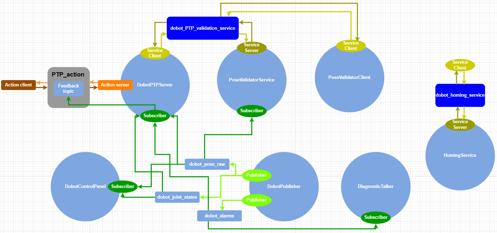

![CAUTION]
The above figure is not up to date with the concurrent code.

Each of the below ROS2 nodes represents a Network port, as each of them are assigned one to allow for the communication between these ROS2 nodes.

![NOTE]
`dobot_msgs` only has custom made message templates the ROS2 nodes can use to communicate with each other. Template messages have been used

<a name="visualization"></a>
## Visualization in RViz
In Rviz, you can display one of up to 8 different robot configurations. All allowed configurations are placed in the diagram below:
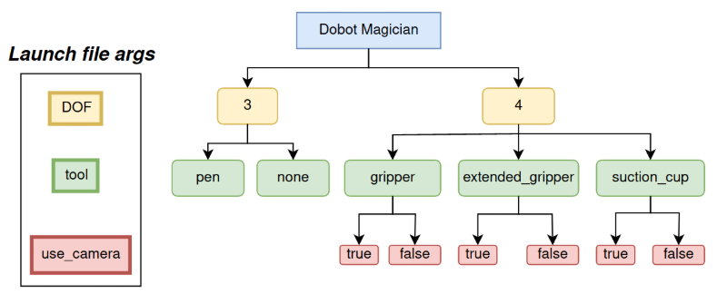  
The command that starts the visualization of the manipulator in the example configuration is as follows: 
```
ros2 launch dobot_description display.launch.py DOF:=4 tool:=extended_gripper use_camera:=true
```
If the robot is disconnected from the computer, you can start the visualization by adding the `gui:=true` argument and control the robot using [**joint_state_publisher_gui**](https://index.ros.org/p/joint_state_publisher_gui/) node. 
  
Below you will find 3 sample visualizations:
<p align="center">
  
</p> 


<a name="kinematics"></a>
## Dobot Magician Kinematics

An implementation of the contents of this section can be found in the file **dobot_nodes/dobot_nodes/_dobot_kinematics.py**.

#### Free Body Diagram
  

#### Denavit-Hartemberg Parameters Modified (DHM)

__i__ | $α_{i-1}$ | $a_{i-1}$ | $d_i$ | $θ_i$ |
--- | - | - | - | -  |
**1** | 0                 | 0     | 0 | $θ_1$
**2** | $-\frac{\pi}{2}$  | 0     | 0 | $θ_2 - \frac{\pi}{2}$
**3** | 0                 | 135mm | 0 | $θ_3 + \frac{\pi}{2} - θ_2$
**4** | 0                 | 147mm | 0 | $-θ_3$ 
**5** | $\frac{\pi}{2}$   | 0     | 0 | $θ_4$

Where $^B_0 T = 
\begin{bmatrix}
    1 & 0 & 0 & 0 \\
    0 & 1 & 0 & 0 \\
    0 & 0 & 1 & 138mm \\
    0 & 0 & 0 & 1
\end{bmatrix}$
, depicting the distance between the bottom of the Dobot Magician and the 1st link, is excluded to suit the Dobot API which builds the foundation of this src.
$T^5_W$ depends on the end-effector used, hence it is also excluded.

<a name="FK"></a>
### Forward kinematics

The forward kinematics of the Dobot Magician has been derived algebraically using the definition of transform matrices using DHM-parameters:

$
^{i-1}_i T = 
\begin{bmatrix}
    1 & 0 & 0 & 0 \\
    0 & \text{cos}(\alpha_{i-1}) & -\text{sin}(\alpha_{i-1}) & 0 \\
    0 & \text{sin}(\alpha_{i-1}) & \text{cos}(\alpha_{i-1}) & 0 \\
    0 & 0 & 0 & 1
\end{bmatrix}
\cdot
\begin{bmatrix}
    1 & 0 & 0 & a_{i-1} \\
    0 & 1 & 0 & 0 \\
    0 & 0 & 1 & 0 \\
    0 & 0 & 0 & 1
\end{bmatrix}
\cdot
\begin{bmatrix}
    \text{cos}(\theta_i) & -\text{sin}(\theta_i) & 0 & 0 \\
    \text{sin}(\theta_i) & \text{cos}(\theta_i) & 0 & 0 \\
    0 & 0 & 1 & 0 \\
    0 & 0 & 0 & 1
\end{bmatrix}
\cdot
\begin{bmatrix}
    1 & 0 & 0 & 0 \\
    0 & 1 & 0 & 0 \\
    0 & 0 & 1 & d_i \\
    0 & 0 & 0 & 1
\end{bmatrix}
$

$= 
\begin{bmatrix}
    \cos(θ_i) & -\sin(θ_i) & 0 & a_{i-1} \\
    \sin(θ_i) \cdot \cos(\alpha_{i-1}) & \cos(θ_i) \cdot \cos(\alpha_{i-1}) & -\sin(\alpha_{i-1}) & -\sin(\alpha_{i-1}) \cdot d_i \\
    \sin(θ_i) \cdot \sin(\alpha_{i-1}) & \cos(θ_i) \cdot \sin(\alpha_{i-1}) & \cos(\alpha_{i-1}) & \cos(\alpha_{i-1}) \cdot d_i \\
    0 & 0 & 0 & 1
\end{bmatrix}$

Using this definition on each DHM-link provides the following result:

* $
^0_1 T = 
\begin{bmatrix}
    \text{cos}(\theta_1) & -\text{sin}(\theta_1) & 0 & 0 \\
    \text{sin}(\theta_1) & \text{cos}(\theta_1) & 0 & 0 \\
    0 & 0 & 1 & 0 \\
    0 & 0 & 0 & 1
\end{bmatrix}
$

* $
^1_2 T = 
\begin{bmatrix}
    \text{sin}(\theta_2) & \text{cos}(\theta_2) & 0 & 0 \\
    0 & 0 & 1 & 0 \\
    \text{cos}(\theta_2) & -\text{sin}(\theta_2) & 1 & 0 \\
    0 & 0 & 0 & 1
\end{bmatrix}
$
* $
^2_3 T = 
\begin{bmatrix}
    \text{sin}(\theta_2-\theta_3) & -\text{cos}(\theta_2-\theta_3) & 0 & 135mm \\
    \text{cos}(\theta_2-\theta_3) & \text{sin}(\theta_2-\theta_3) & 0 & 0 \\
    0 & 0 & 1 & 0 \\
    0 & 0 & 0 & 1
\end{bmatrix}
$
* $
^3_4 T = 
\begin{bmatrix}
    \text{cos}(\theta_3) & \text{sin}(\theta_3) & 0 & 147mm \\
    -\text{sin}(\theta_3) & \text{cos}(\theta_3) & 0 & 0 \\
    0 & 0 & 1 & 0 \\
    0 & 0 & 0 & 1
\end{bmatrix}
$
* $
^4_5 T = 
\begin{bmatrix}
    \text{sin}(\theta_4) & \text{cos}(\theta_4) & 0 & 0 \\
    0 & 0 & 1 & 0 \\
    \text{cos}(\theta_4) & -\text{sin}(\theta_4) & 1 & 0 \\
    0 & 0 & 0 & 1
\end{bmatrix}
$

To keep things simple, the resulting position vector $^0_5 P$ of $^0_5 T=\begin{bmatrix} ^0_5 R & ^0_5 P \\ \vec{0} & 1 \end{bmatrix}$ will be displayed here... :

$ 
^0_5 P = 
\begin{bmatrix}
    147 \cdot \text{cos}(\theta_1) \cdot \text{sin}(\theta_2) \cdot \text{sin}(\theta_2 - \theta_3) + 147 \cdot \text{cos}(\theta_1) \cdot \text{cos}(\theta_2) \cdot \text{cos}(\theta_2 - \theta_3) + 135 \cdot \text{cos}(\theta_1) \cdot \text{sin}(\theta_2) \\
    147 \cdot \text{sin}(\theta_1) \cdot \text{sin}(\theta_2) \cdot \text{sin}(\theta_2 - \theta_3) + 147 \cdot \text{sin}(\theta_1) \cdot \text{cos}(\theta_2) \cdot \text{cos}(\theta_2 - \theta_3) + 135 \cdot \text{sin}(\theta_1) \cdot \text{sin}(\theta_2) \\
    147 \cdot \text{cos}(\theta_2) \cdot \text{sin}(\theta_2 - \theta_3) - 147 \cdot \text{sin}(\theta_2) \cdot \text{cos}(\theta_2 - \theta_3) + 135 \cdot \text{cos}(\theta_2)
\end{bmatrix} = \begin{bmatrix}
    \text{cos}(\theta_1) \cdot \begin{pmatrix} 147 \cdot \begin{pmatrix} \text{sin}(\theta_2) \cdot \text{sin}(\theta_2 - \theta_3) + \text{cos}(\theta_2) \cdot \text{cos}(\theta_2 - \theta_3) \end{pmatrix} + 135 \cdot \text{sin}(\theta_2) \end{pmatrix}  \\
    \text{sin}(\theta_1) \cdot \begin{pmatrix} 147 \cdot \begin{pmatrix} \text{sin}(\theta_2) \cdot \text{sin}(\theta_2 - \theta_3) + \text{cos}(\theta_2) \cdot \text{cos}(\theta_2 - \theta_3) \end{pmatrix} + 135 \cdot \text{sin}(\theta_2) \end{pmatrix} \\
    147 \cdot \begin{pmatrix} \text{cos}(\theta_2) \cdot \text{sin}(\theta_2 - \theta_3) - \text{sin}(\theta_2) \cdot \text{cos}(\theta_2 - \theta_3) \end{pmatrix} + 135 \cdot \text{cos}(\theta_2)
\end{bmatrix} = \begin{bmatrix}
    \text{cos}(\theta_1) \cdot \begin{pmatrix} 147 \cdot \text{cos}(\theta_3) + 135 \cdot \text{sin}(\theta_2) \end{pmatrix}  \\
    \text{sin}(\theta_1) \cdot \begin{pmatrix} 147 \cdot \text{cos}(\theta_3) + 135 \cdot \text{sin}(\theta_2) \end{pmatrix} \\
    135 \cdot \text{cos}(\theta_2) - 147 \cdot \text{sin}(\theta_3)
\end{bmatrix}
$

... and the simplified rotation matrix $R^0_5$ will be displayed here:

$^0_5 R = \begin{bmatrix}
    \text{cos}(\theta_1 + \theta_4) & -\text{sin}(\theta_1 + \theta_4) & 0 \\
    \text{sin}(\theta_1 + \theta_4) & \text{cos}(\theta_1 + \theta_4) & 0 \\
    0 & 0 & 1
\end{bmatrix} = R_Z(\theta_1 + \theta_4) <=> R_Z = \theta_1 + \theta_4
$

<a name="IK"></a>
### Inverse kinematics

The inverse kinematics of the Dobot Magician is derived using a geometric approach.

#### Finding $\theta_1$

Using $^0_5 T$, it turns out that the direction the robot is facing solely depends on $\theta_1$ as shown in the figure below:

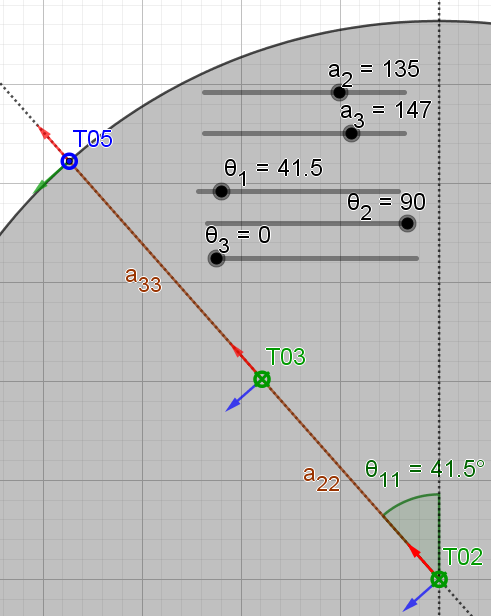 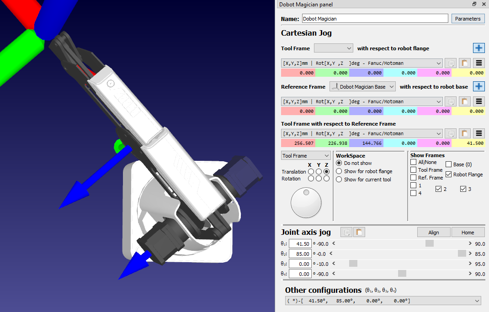

Because of this, $\theta_1$ can be found as the inverse tangent of the x- and y-coordinates of $^0_5 T$. To take into account all $360\degree$ around the robot, atan2 is used:

$θ_1 = \text{atan2}({^0_5 T_y}, {^0_5 T_x})$

#### Finding $\theta_4$
Using $\theta_1$, $\theta_4$ can be found trivially easy by isolating it from the expression derived for the forward kinematics of the Dobot Magician.

$R_Z = \theta_1 + \theta_4 <=> \theta_4 = R_Z - \theta_1$

#### Finding $\theta_2$
Having found $\theta_1$ and $\theta_4$, the transform matrix $^0_5 T$ can be decoupled into $^1_4 T$ using the expression:

$^1_4 T = ^0_1 T^{-1} \cdot ^0_5 T \cdot ^4_5 T^{-1}$

By comparing the vectors $^1_4 P$ and $^0_5 P$, a trick can be used to seamlessly transition between the two:

$^1_4 P = \begin{bmatrix}
    147 \cdot \text{cos}(\theta_3) + 135 \cdot \text{sin}(\theta_2)  \\
    0 \\
    135 \cdot \text{cos}(\theta_2) - 147 \cdot \text{sin}(\theta_3)
\end{bmatrix}$

The trick being that because $^1_4 P_x$ is the diagonal of $^0_5 P_x$ and $^0_5 P_y$, $^0_5 P_{xy}$, it is same to assume that $^0_5 P_{xy}=^1_4 P_x$.

$^1_4 P_x = ^0_5 P_{xy} = \sqrt{{^0_5 P_x}^2 + {^0_5 P_y}^2}$

Likewise, the diagonal $^1_4 P_{xz}$ can be expressed as $^0_5 P_{xyz}$ which is the diagonal of $^0_5 P_x$, $^0_5 P_y$, and $^0_5 P_z$.

$^1_4 P_{xz} = \sqrt{{^1_4 P_x}^2 + {^1_4 P_z}^2} = ^0_5 P_{xyz} = \sqrt{{^0_5 P_x}^2 + {^0_5 P_y}^2 + {^0_5 P_z}^2}$

Using this trick, it becomes plausible to draw a triangle around the joints 2 and 3 using the xz-plane of $^1_4 P$. A sketch of this xz-plane is shown below:

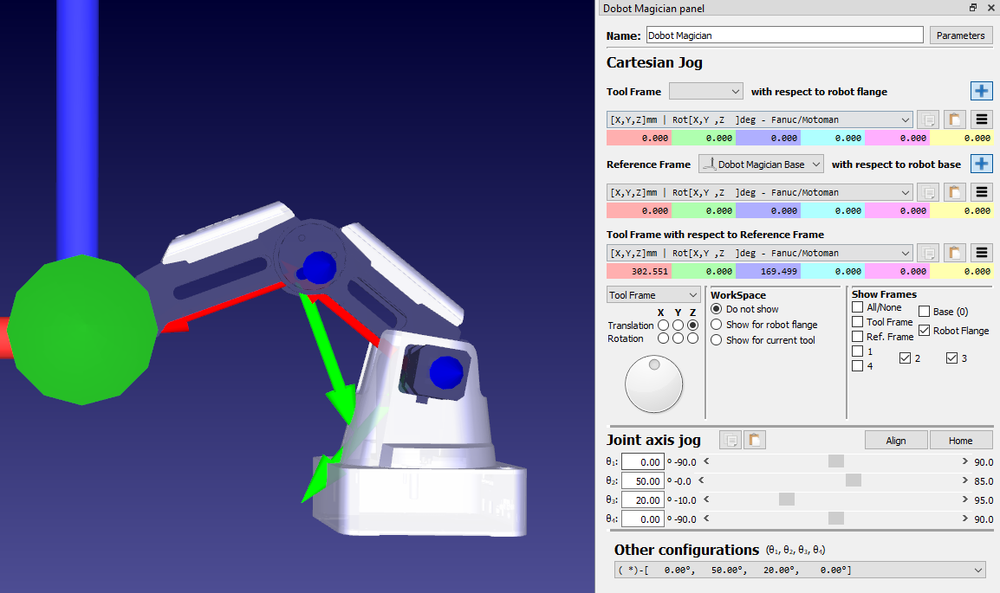 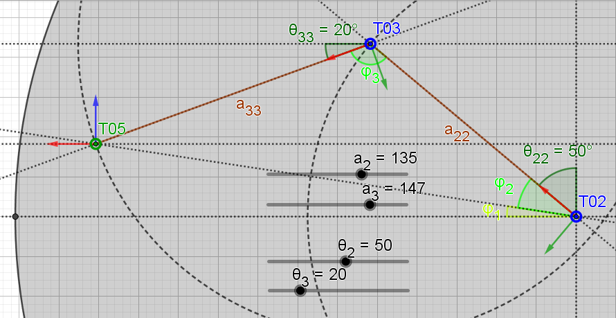

In conjunction with the above figure, cosine of a right triangle will be used to derive the expression 

$\varphi_1=\text{cos}^{-1} \begin{pmatrix} ^0_5 P_{xy} / ^0_5 P_{xyz} \end{pmatrix}$,

while the law of cosine will be used to derive the expression 

$\varphi_2=\text{cos}^{-1} \begin{pmatrix} ( {{^0_5 P_{xyz}}}^2 + {a_2}^2 - {a_3}^2 ) / ( 2 \cdot {^0_5 P_{xyz}} \cdot a_2 ) \end{pmatrix}$

Using $\varphi_1$ and $\varphi_2$, $\theta_2$ can be found as:

$\theta_2 = \frac{\pi}{2} - \varphi_1 \pm \varphi_2$

#### Finding $\theta_3$
Using the same figure above, the law of cosine will be used to derive the expression:

$\varphi_3 = \text{cos}^{-1} \begin{pmatrix} ( {a_2}^2 + {a_3}^2 - {^0_5 P_{xyz}}^2 ) / 2 \cdot a_2 \cdot a_3 \end{pmatrix}$

Using $\varphi_3$ an $\theta_2$, $\theta_3$ can be derived as:

$\theta_3 = \frac{\pi}{2} \pm \varphi_3 + \theta_2$

#### Summary of Inverse Kinematics of Dobot Magician

$$\begin{Bmatrix} 
    θ_1 = & \text{atan2}({^0_5 T_y}, {^0_5 T_x}) \\
    θ_2 = & [\frac{\pi}{2} - \varphi_1 + \varphi_2, \frac{\pi}{2} - \varphi_1 - \varphi_2] \\
    θ_3 = & [\frac{\pi}{2} + \varphi_3 + \theta_2, \frac{\pi}{2} - \varphi_3 + \theta_2] \\
    θ_4 = & R_z - θ_1
\end{Bmatrix}$$

In theory, the Dobot Magician has 2 Inverse Kinematic solutions. But only one will be nessecary due to the Dobot Magician being limited in joint space.

$$\begin{Bmatrix} 
    θ_1 = & \text{atan2}({^0_5 T_y}, {^0_5 T_x}) \\
    θ_2 = & \frac{\pi}{2} - \varphi_1 - \varphi_2 \\
    θ_3 = & \frac{\pi}{2} - \varphi_3 + \theta_2 \\
    θ_4 = & R_z - θ_1
\end{Bmatrix}$$

One such example of why only one of the Inverse Kinematic solutions will be nessecary is shown below:


<a name="workspace"></a>
## Dobot Magician workspace

The Dobot Magician has a quite peculiar workspace as shown below:

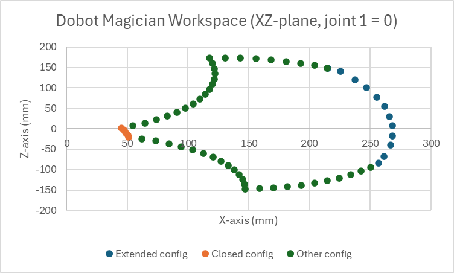

Joint | 1 | 2 | 3 | 4
--- | --- | --- |--- | --- |
Min | $-125\degree$ | $\begin{Bmatrix} -5\degree & \text{ if } & \theta_3 \le 65\degree \\ \theta_3 - 70\degree & \text{ if } & 90\degree > \theta_3 > 65\degree \end{Bmatrix}$ | $\begin{Bmatrix} -15\degree & \text{ if } & \theta_2 \le 40\degree \\ \theta_2 - 55\degree & \text{ if } & 90\degree > \theta_2 > 40\degree \end{Bmatrix}$ | $-150\degree$
Max | $125\degree$  | $\begin{Bmatrix} \theta_3 + 55\degree & \text{ if } & 35\degree > \theta_3 > -5\degree \\ 90\degree & \text{ if } & \theta_3 \ge 35\degree \end{Bmatrix}$ | $\begin{Bmatrix} \theta_2 + 70\degree & \text{ if } & 20\degree > \theta_2 > -15\degree \\ 90\degree & \text{ if } & \theta_2 \ge 20\degree \end{Bmatrix}$ | $150\degree$

To intuitively understand what the above means, understand that joint 2 has full maneuverability when $65\degree > \theta_3 > 35\degree$ while  joint 3 has full maneuverability when $40\degree > \theta_2 > 20\degree$. 

The way the above expressions for joint 2 and 3 have been derived is through an experiment consisting of testing the limits of the workspace manually while the Dobot Magician LED lit up green (not red). This was done using a "closed configuration" and "Parallelogram configuration" of the Dobot Magician. Below is a dataset of the joint configurations obtained doing the experiment.

### Dobot Magician workspace plotted
The below figure depicts the workspace of the Dobot Magician with the inside space made from the dots being that workspace.

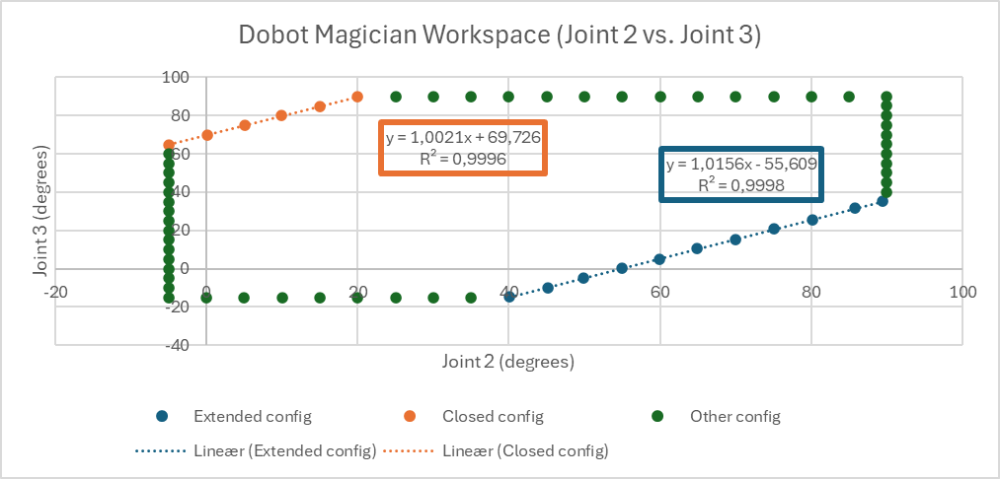


### Extended and closed configuration
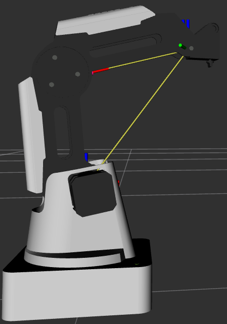 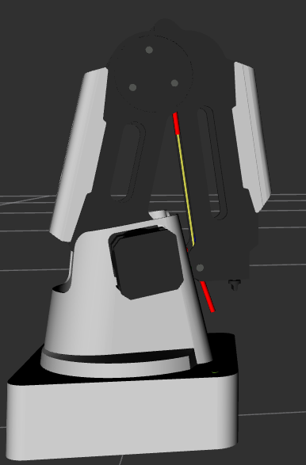 


<a name="trajectory"></a>
## Trajectory generation
A trajectory validator has been made to ensure the Dobot Magician does not attempt to make any unfeasible moves which cause the Dobot Magician to have to reboot, and with that any code that is used along with it. This trajectory validator must account for all the types of movements the Dobot Magician can make. The Dobot Magician has the following moveset:
* PTP
    * MoveJ
    * MoveL
* MoveC (Arc)

### PTP

The PTP command either takes the most efficient path from A to B using either the path of least resistance of each joint (MoveJ) or the linearly speaking shortest path (MoveL).

Because of this, using PTP with the Dobot Magician is categorized into "motion types" as described below:

motion_type | Coordinates | movement type
--- | --- | --- |
1 | Cartesian [X, Y, Z, R] | MoveJ
2 | Cartesian [X, Y, Z, R] | MoveL
4 | Joint [θ1, θ2, θ3, θ4] | MoveJ
5 | Joint [θ1, θ2, θ3, θ4] | MoveL

**NOTE: [X, Y, Z, R] has units [mm, mm, mm, °]. [θ1, θ2, θ3, θ4] has units [°, °, °, °].**

* **velocity_ratio** (default 1.0)
* **acceleration_ratio** (default 1.0) 

<a name="movej"></a>
#### PTP MoveJ
The "Move Joint" aka. MoveJ command is designed to traject a robotic arm towards a destination in the path of least resistance. This means MoveJ is the most efficient in terms of general joint movement and is thus the go-to for any movement without any precautions.

The MoveJ command moves on a joint-by-joint basis, meaning so long as the movevent stays within the Dobot Magician workspace, the trajectory will be feasible. Below is a flow diagram of the steps which must be taken to allow the Dobot Magician to prompt a MoveJ command:

<a name="movel"></a>
#### PTP MoveL
The "Move Linear" aka. MoveL command is designed to traject a robotic arm towards a destination in a linear path. This means MoveL is the go-to for any precise movements which leave no room for any margin of error.

The MoveL command moves on a axis-by-axis basis, meaning a risk of the joints moving outside its workspace while following a MoveL command exists. To prevent this, the trajectory validator must validate the entire linear path taken using a MoveL command. This will be done in steps as shown in the below flow diagram:


<a name="movec"></a>
#### MoveC (Arc)
The "Move Circular" aka. MoveC command is designed to traject a robotic arm in an arc (a smooth curve). This means MoveC is the go-to in cases where the robotic arm must make a specific kind of curve to fit the user needs.

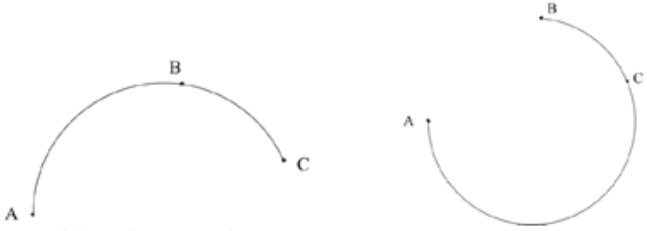

Because the MoveC command moves in a curve, a risk lies in any part of the curve ending up outside the Dobot Magician workspace. Creating a trajectory validator for the MoveC command relies on establishing the circular path which the MoveC command uses to move. This is done by using 3 point: A staring point $P_0$, a circumference point $P_c$, and an ending point $P_f$. These 3 points are used to construct a parameter function like the one below:

$$P_{circle}(t)=P_{center} + \vec{v} \cdot \text{cos}(t) + \vec{w} \cdot \text{sin}(t)$$

Where:

$$\begin{matrix} P_{center} = P_0 + \frac{||\vec{b}||^2 \cdot (\vec{c} \times (\vec{b} \times \vec{c})) + ||\vec{c}||^2 \cdot (\vec{b} \times (\vec{c} \times \vec{b}))}{2 \cdot ||\vec{b} \times \vec{c}||^2}, & \vec{b} = P_c - P_0, & \vec{c} = P_f - P_0 \end{matrix}$$
$$\begin{matrix} \vec{v} = \frac{P_0 - P_{center}}{r}, & \vec{w} = \frac{\vec{n}}{||\vec{n}||} \times \vec{v}, & r = ||P_{center} - P_0|| \end{matrix}$$

Details on how the trajectory of the MoveC command is calculated is shown in the below sketches.

 

<a name="function_time"></a>
## Calculating function time $t_f$ assuming LSPB is used
Assuming the Dobot Magician generates its trajectory based on a Parabolic blend, assuming a constant acceleration and deceleration, an estimated function time $t_f$ can be found for any trajectory of the Dobot Magician. 

#### Linear Segments with Parabolic Blends (LSPB)


The LSPB is derived using the 3 Kinematics Equations in terms of rotation $θ(t)$

$$\begin{matrix}
    θ(t) = & \frac{1}{2} \ddot{θ} \cdot t^2 + \dot{θ}_0 \cdot t + θ_0 \\
    \dot{θ}(t) = & \ddot{θ} \cdot t + \dot{θ}_0 \\
    \dot{θ}(t)^2 = & \dot{θ}^2_0 + 2 \ddot{θ} \cdot (θ_f - θ_0)
\end{matrix}$$

Using the below 4 constraints:
- $θ(0) = θ_0$
- $θ(f) = θ_f$
- $\dot{θ}(0) = \dot{θ}_0 = 0$
- $\dot{θ}(f) = \dot{θ}_f = 0$

The above 3 Kinematics Equations wind up like this:

$$\begin{matrix} 
    θ(t) = & \frac{1}{2} \ddot{θ} \cdot t^2 + θ_0 \\
    \dot{θ}(t) = & \ddot{θ} \cdot t \\
    \dot{θ}(t)^2 = & 2 \ddot{θ} \cdot (θ_f - θ_0)
\end{matrix}$$

Using these 3 equations, the 3 segments of the Parabolic Blend can be defined as:

$$θ(t) = \begin{Bmatrix} 
    \begin{matrix} θ_0 + \frac{1}{2} \ddot{θ} \cdot t^2, & \text{if } t_0 \leq t \leq t_b \\
    θ_b + \ddot{θ} \cdot t_b \cdot (t - t_b),  & \text{if } t_b < t < t_f - t_b \\
    θ_f - \frac{1}{2} \ddot{θ} \cdot t^2 + θ_0,  & \text{if } t_f - t_b \leq t \leq t_f \end{matrix}
\end{Bmatrix} \text{, for} \begin{bmatrix} t_0, t_f \end{bmatrix} $$

Where

$$t_b = \frac{t_f}{2} - \text{abs} \begin{pmatrix} \sqrt{ \frac{\ddot{θ}^2 \cdot t_f^2 - 4 \cdot \ddot{θ} \cdot (Pe-Ps) }{(2 \cdot \ddot{θ})}} \end{pmatrix}$$

The parabolic blend comes with its own condition, because it has to comply with the 3 Kinematic Equations. Using the third Kinematic Equation, this condition can be derived assuming no overlap occurs between the 3 segments meaning, $t_f \geq 2 t_b$ must be true:

$$ \dot{θ}(t_b)^2 = 2 \ddot{θ} \cdot (θ_f - θ_0) \to 
\dot{θ}(t_f)^2 \geq 4 \ddot{θ} \cdot (θ_f - θ_0) \to
(\ddot{θ} \cdot t_f)^2 \geq 4 \ddot{θ} \cdot (θ_f - θ_0) \to 
\ddot{θ} \geq \frac{4 \cdot (θ_f - θ_0)}{t_f^2}$$

#### Calculating execution time $t_f$
Consider that the Parabolic Blend has a maximum velocity $v_{max}$ and maximum acceleration ${a_{max}}$. This means the Parabolic Blend has a velocity of $v_{max}$ during its linear segment and an acceleration of $a_{max}$ during acceleration (negative $a_{max}$ during deceleration). This way, the time $t_b$ becomes equal to:

$$ t_b = v_{max} / a_{max} $$

Using $t_b$, it becomes possible to determine the execution time $t_f$. In cases where $2 t_b \geq t_f$, $t_f$ becomes:

$$ \begin{matrix} 
    t_f = \sqrt{ \frac{4 \cdot (θ_f - θ_0)}{a_{max}} }, & \text{ if } & 2 t_b \geq t_f 
\end{matrix} $$

Note how even though the expression $2 t_b > t_f$ is theoretically implausible, it accounts for cases when the specified $v_{max}$ surpases the maximum reached velocity of the specified Parabolic Blend.

On the other hand, when $2 t_b < t_f$, the linear segment has to be taken into account. This is done by using the below expression:

$$ \begin{matrix} 
    t_f = t_b + \frac{θ_f - θ_0}{v_{max}}, & \text{ if } & 2 t_b < t_f 
\end{matrix} $$

Using the two above equation describing execution time $t_f$, the theoretically lowest $t_f$ is acquired assuming the specified $v_{max}$ and $a_{max}$ apply to the trajectory. That is to say these equations assume a parabolic blend is used as the trajectory planner.

$$\begin{Bmatrix} 
    t_f = t_b + \frac{θ_f - θ_0}{v_{max}}, & \text{ if } & 2 t_b < t_f \\
    t_f = \sqrt{ \frac{4 \cdot (θ_f - θ_0)}{a_{max}} }, & \text{ if } & 2 t_b \geq t_f
\end{Bmatrix} $$

Fortunately, the above equation works with with multiple axes for both MoveJ, provided the used $\theta_f-\theta_0$ is the one with the highest/maximum value. As for MoveL, provided the appropriate $v_{max}$ and $a_{max}$ in terms of cartesian movement, the equation looks pretty much the same. And with MoveC, the length of the traversed curve is used. Below, the equation of $t_f$ can be seen for MoveJ, MoveL, and MoveC:

$$\begin{matrix}
    MoveJ:&\begin{Bmatrix} 
        t_f = t_b + \frac{\text{max}(\vec{θ_f} - \vec{θ_0})}{v_{max}}, & \text{ if } & 2 t_b < t_f \\
        t_f = \sqrt{ \frac{4 \cdot \text{max}(\vec{θ_f} - \vec{θ_0})}{a_{max}} }, & \text{ if } & 2 t_b \geq t_f
    \end{Bmatrix} 
    \\\\
    MoveL:&\begin{Bmatrix} 
        t_f = t_b + \frac{\text{max}(\vec{P_f} - \vec{P_0})}{v_{max}}, & \text{ if } & 2 t_b < t_f \\
        t_f = \sqrt{ \frac{4 \cdot \text{max}(\vec{P_f} - \vec{P_0})}{a_{max}} }, & \text{ if } & 2 t_b \geq t_f
    \end{Bmatrix}, & \text{where } \vec{P} = \begin{bmatrix} x \\ y \\ z \\ R_z \end{bmatrix}
    \\\\
    MoveC:&\begin{Bmatrix} 
        t_f = t_b + \frac{L_{P(t)}}{v_{max}}, & \text{ if } & 2 t_b < t_f \\
        t_f = \sqrt{ \frac{4 \cdot L_{P(t)}}{a_{max}} }, & \text{ if } & 2 t_b \geq t_f
    \end{Bmatrix}, & \text{where } L_{P(t)} = 2 \cdot r \cdot \pi \cdot \angle
\end{matrix}$$

Where $L_{P(t)} = \int^{P(t)=P_f}_0 \sqrt{||P'(t)||} \cdot dt = 2 \cdot r \cdot \pi \cdot \angle$, where $\angle$ is the angle between the vectors $\vec{u}$ and $\vec{P_3 P_{center}}$, because the function $P(t)$ ultimately is a circle.