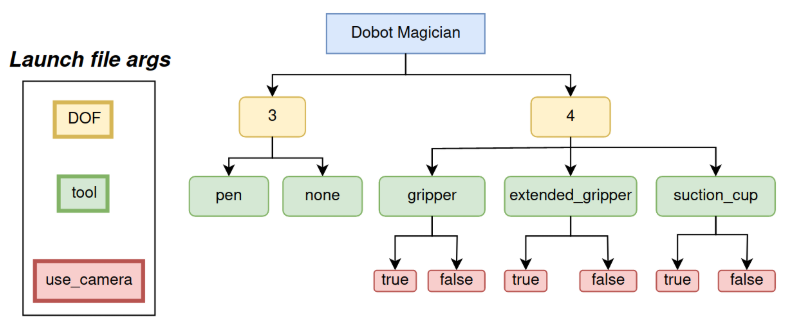
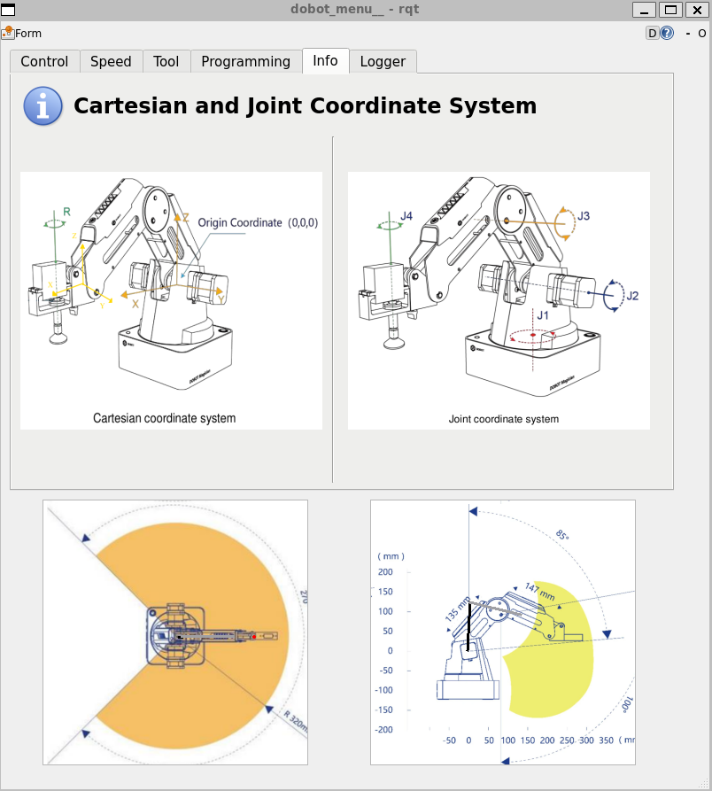

# ROS 2 control stack for Dobot Magician  
    [](https://opensource.org/licenses/MIT)

<p align="center">


</p> 

**This project was originally forked from [this GitHub-repository](https://github.com/jkaniuka/magician_ros2).**

## Table of contents :clipboard:
* [Installation](#installation)
* [How to start up the source code (src)](#startup)
* [Command API](#commands)
* [Motion](#motion)
* [Visualization in RViz](#visualization)

<a name="installation"></a>
## Installation :arrow_down:
*This repository uses ~200MB (~5GB including ROS2 Humble and other installed packages).* 

This section provides a short guide to installing this repository using ROS2 Humble. *If you want to try installing this repository not using Ubuntu-22.04 + ROS2 Humble, do so at your own discretion.*


ROS2 compatibility | Compatible
--- | --- |
Ubuntu-25.04 + ROS2 Kilted | ❓
Ubuntu-24.04 + ROS2 Jazzy | ❌
Ubuntu-23.04 + ROS2 Iron | ❓
Ubuntu-22.04 + ROS2 Humble | ✅
Ubuntu-20.04 + ROS2 Galactic | ❓
...  | ❓

First, install Ubuntu-22.04 using one of the below options:

- Install WSL2 by opening **command prompt** and typing `wsl install -d Ubuntu-22.04`. *Only works with windows*
- Use a virtual machine (VM). If you're new to VMs, I recommend VMware.

*In case you are using WSL2, you need to [install usbipd](https://github.com/dorssel/usbipd-win/releases/tag/v5.3.0) for windows to be able to transfer USB data to WSL2.*

*In case you are using a VM, allow data transfer using USB ports with the command* `sudo usermod -a -G dialout <username>`.

<a name="installation_repo"></a>
### How to install this repository

Start off by opening a **linux terminal**. If you are using WSL2, do so by opening **command prompt** and typing `wsl -d Ubuntu-22.04`

Inside the opening **linux terminal**, paste the following:

```
cd ~
mkdir -p ~/ws_magician/src # Creates directory
git clone https://github.com/SaltworkerMLU/magician_ros2.git ~/ws_magician/src --branch magician_ros2_MLU
```

After doing so, paste the following into the **linux terminal**: `bash ~/ws_magician/src/terminal/install_dependencies.bash`

When this is done, reboot linux. If you are using WSL2, open a new **command prompt** and type `wsl --shutdown` followed by `wsl -d Ubuntu-22.04`

After rebooting linux, copy the following into your terminal: 

```
cd ~/ws_magician
colcon build
```
*Building using **colcon build** from the wrong folder will cause the build to not load when prompted*.

*If you are using WSL2, open a **command prompt** and run the command* `cp ~/ws_magician/src/terminal/usb2WSL_dobot.bat /mnt/c/users/YOUR_USERNAME/Desktop` *to copy the windows batch file used to connect the dobot magician via usb to WSL2 into the desktop folder.*

<a name="startup"></a>
## How to start up the source code (src)

*If you are using WSL2, run the windows batch file **usb2WSL_dobot.bat** to connect the Dobot Magician to WSL2, enabling it to be used with the src.*

After installing and building everything, open a **linux terminal** and run the command `bash ~/ws_magician/src/terminal/dobot_bootup.bash`.

#### If you want to edit the source code, simply open a linux terminal, navigate to ~/ws_magician, and then type `code .`. This will open Visual Studio Code and install it if not done. After editing the code, use `colcon build` to build your revamped version of the src.

<a name="commands"></a>
## A list of commands you can run with the source code

Example script | description
--- | --- |
`ros2 run dobot_demos test_gripper` | Tests gripper
`ros2 run dobot_demos test_suction_cup` | Tests suction cup
`ros2 run dobot_demos test_homing` | Homes the dobot
`ros2 run dobot_demos test_point_to_point` | Moves to a certain spot using PTP movement
`ros2 run dobot_demos test_pick_and_place` | Does a sequence of PTP movements while picking and placing objects in the dobot's way.

Service command | description
--- | --- |
`ros2 service call /dobot_homing_service dobot_msgs/srv/ExecuteHomingProcedure` | Initiates homing of the dobot.
`ros2 service call /dobot_gripper_service dobot_msgs/srv/GripperControl "{gripper_state: 'open', keep_compressor_running: true}"` | `gripper state` (type _string_) : _open/close_ & `keep_compressor_running` (type _bool_) : _true/false_
`ros2 service call /dobot_suction_cup_service dobot_msgs/srv/SuctionCupControl "{enable_suction: true}"` | `enable_suction` (type _bool_) : _true/false_

Action command | description
--- | --- |
`ros2 action send_goal /PTP_action  dobot_msgs/action/PointToPoint "{motion_type: 1, target_pose: [150.0, 0.0, 100.0, 0.0], velocity_ratio: 0.5, acceleration_ratio: 0.3}" --feedback` | Trajects the dobot towards the specified target_pose and motion_type.
`ros2 action send_goal /Arc_action  dobot_msgs/action/ArcMotion "{circumference_point: [175.0, 25.0, 100.0, 0.0], ending_point: [200.0, 0.0, 100.0, 0.0], velocity_ratio: 0.5, acceleration_ratio: 0.3}" --feedback` | Trajects the dobot toward the specified ending_point via. the circumference_point, resulting in a curved arc-like movement.
`ros2 action send_goal /draw_circle dobot_msgs/action/DrawCircle "{target_pose: [150, 0, 100, 0], radius: 25, z_level: -74, velocity_ratio: 0.5, acceleration_ratio: 0.3}" --feedback` | Draws a horizontal circle. Use this command with the pen gripper.

**Adding `--feedback` flag will cause the terminal to display the current position of the robot while it is moving**

Other commands | image
--- | --- |
`rqt -s rqt_robot_monitor` |  
`rqt -s dobot_menu` | 
`ros2 launch` <br> `dobot_description` <br> `display.launch.py DOF:=3 `<br>` tool:=none `<br>` use_camera:=false` | 

<a name="motion"></a>
## Motion

### Point-To-Point (PTP)
The PTP command either takes the most efficient path from A to B using the path of least resistance of each joint (MoveJ) or the linearly speaking shortest path (MoveL).

Because of this, using PTP with the Dobot Magician is categorized into "motion types" as described below:

motion_type | Coordinates | movement type
--- | --- | --- |
1 | Cartesian [X, Y, Z, R] | MoveJ
2 | Cartesian [X, Y, Z, R] | MoveL
4 | Joint [θ1, θ2, θ3, θ4] | MoveJ
5 | Joint [θ1, θ2, θ3, θ4] | MoveL

**NOTE: [X, Y, Z, R] has units [mm, mm, mm, °]. [θ1, θ2, θ3, θ4] has units [°, °, °, °].**

* **velocity_ratio** (default 1.0)
* **acceleration_ratio** (default 1.0)  

### Arc
The Arc command makes the dobot magician move in a circular arc-like movement as shown with the figure below:


<a name="visualization"></a>
## Visualization in RViz
In Rviz, you can display one of up to 8 different robot configurations. All allowed configurations are placed in the diagram below:
  
The command that starts the visualization of the manipulator in the example configuration is as follows: 
```
ros2 launch dobot_description display.launch.py DOF:=4 tool:=extended_gripper use_camera:=true
```
If the robot is disconnected from the computer, you can start the visualization by adding the `gui:=true` argument and control the robot using [**joint_state_publisher_gui**](https://index.ros.org/p/joint_state_publisher_gui/) node. 
  
Below you will find 3 sample visualizations:
<p align="center">
  
</p> 


<a name="dmcp"></a>
## Dobot Magician Menu
Dobot Magician Menu is an RQT plugin that allows you to do pretty much everything you need to do with the dobot: 
* Position the manipulator and modify motion parameters
* Visualize its state
* Control end effectors
* Program instructions into the dobot using bash programming

Below you will find screenshots of all the plugin screens:

<p align="center">
  &nbsp;&nbsp;&nbsp;&nbsp;&nbsp;&nbsp;&nbsp;&nbsp;&nbsp;&nbsp;&nbsp;&nbsp
</p> 

<p align="center">
  &nbsp;&nbsp;&nbsp;&nbsp;&nbsp;&nbsp;&nbsp;&nbsp;
</p> 