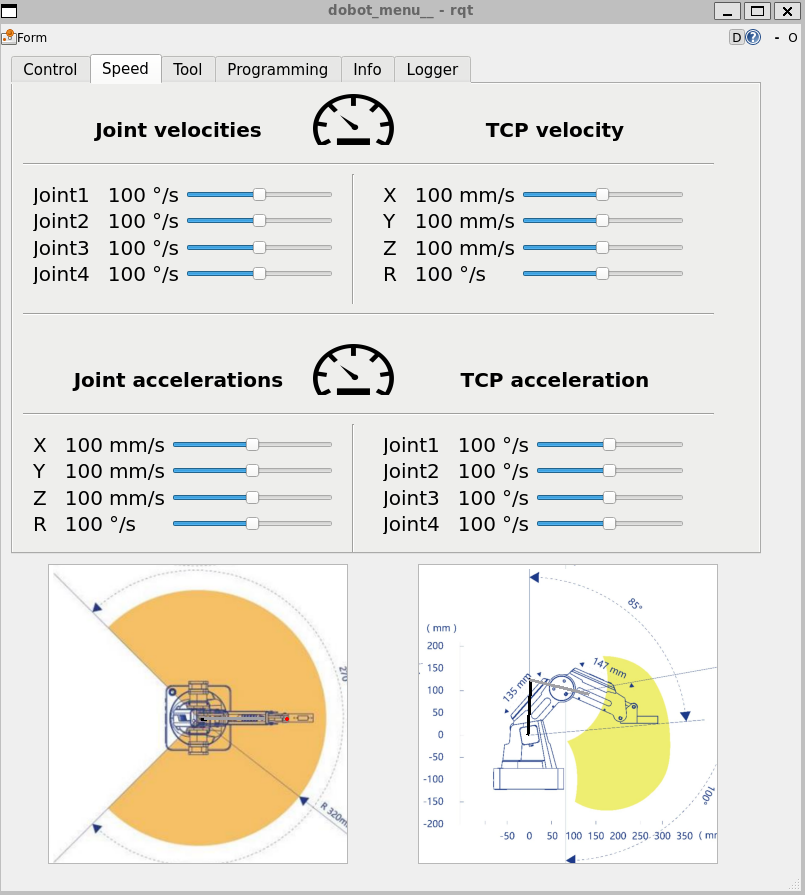

# ROS 2 control stack for Dobot Magician  
    [](https://opensource.org/licenses/MIT)

<p align="center">


</p> 

**This project was originally forked from [this GitHub-repository](https://github.com/jkaniuka/magician_ros2).**

## Table of contents :clipboard:
* [Installation](#installation)
* [Command API](#commands)
* [Motion](#motion)
* [Visualization in RViz](#visualization)
* [Additional tools for visualization](#additional)

<!-- 
<a name="packages"></a>
## Packages in the repository :open_file_folder:

  - `dobot_bringup` - launch files and parameters configuration (in _YAML_ files)
  - `dobot_control_panel` - RQT plugin to control Dobot Magician robotic arm (as well as sliding rail)
  - `dobot_demos` - a collection of sample scripts for beginners (_minimal working examples_)
  - `dobot_description` - package containing URDF description of Dobot Magician together with meshes
  - `dobot_diagnostics` - aggregation and analysis of alarm states
  - `dobot_driver` - low-level Python interface to communicate with Dobot via serial port 
  - `dobot_end_effector` - set of service servers allowing to control different kinds of end effectors
  - `dobot_homing` - tool for executing homing procedure of Dobot stepper motors
  - `dobot_kinematics` -  implementation of forward and inverse kinematics to validate trajectory feasibility
  - `dobot_motion` - package containing action server to control motion of Dobot Magician (joint interpolated motion / linear motion)
  - `dobot_msgs` -  package defining messages used by control stack
  - `dobot_state_updater` - package containing a node regularly retrieving information about the state of the robot (e.g. joint angles / TCP position)
  - `dobot_visualization_tools` - useful tools for visualization (e.g. trajectory / range) in form of RViZ markers 
-->

<a name="installation"></a>
## Installation :arrow_down:
*This repository uses ~200MB (~5GB including ROS2 Humble and other installed packages).* 

This section provides a short guide to installing this repository using ROS2 Humble. *If you want to try installing this repository not using Ubuntu-22.04 + ROS2 Humble, do so at your own discretion.*


ROS2 compatibility | Compatible
--- | --- |
Ubuntu-25.04 + ROS2 Kilted | ❓
Ubuntu-24.04 + ROS2 Jazzy | ❌
Ubuntu-23.04 + ROS2 Iron | ❓
Ubuntu-22.04 + ROS2 Humble | ✅
Ubuntu-20.04 + ROS2 Galactic | ❓
...  | ❓

First, install Ubuntu-22.04 using one of the below options:

- Install WSL2 by opening **command prompt** and typing `install -d Ubuntu-22.04`. *Only works with windows*
- Use a virtual machine (VM). If you're new to VMs, I recommend VMware.

<a name="installation_repo"></a>
### A simplified way to install this repository

Open a linux terminal or the program "Ubuntu 22.04 LTS" if you're using WSL2 and paste the following:

```
cd ~

# Create file "install_repository.bash"
touch install_repository.bash

# --------------------------------------------------------- #
# This writes everything nessecary into the file.           # 
# --------------------------------------------------------- #
cat > install_repository.bash << EOF
# Download this repository into a specified folder
project_repo_name=\$1
if [ "\$project_repo_name" == "" ]; then
  project_repo_name=ws_magician # The default project_repo_name
fi
project_path="\$project_repo_name/src"
mkdir -p \$project_path # Creates directory
git clone https://github.com/SaltworkerMLU/magician_ros2.git \$project_path --branch magician_ros2_MLU

# Option to auto bootup ros2_magician_mlu when terminal is opened.
ros2_magician_mlu=\$2 # The argument passed along this bash file

echo "" >> ~/.bashrc; # Creates empty line
echo "export MAGICIAN_TOOL=none" >> ~/.bashrc;
echo "source ~/\$project_repo_name/install/setup.bash" >> ~/.bashrc;

if [ \$ros2_magician_mlu == "auto_bootup" ]; then
    echo "" >> ~/.bashrc; # Creates empty line
    echo "# Boots up ros2_magician_mlu whenever terminal is opened" >> ~/.bashrc;
    echo "folder=\"\\\$(pwd)\"" >> ~/.bashrc;
    echo "cd ~/\$project_repo_name" >> ~/.bashrc;
    echo "if [ \\\$folder == "/home/vboxuser" ] || [ \\\$folder == "/mnt/c/Windows" ]; then" >> ~/.bashrc;
    echo "  bash ~/\$project_repo_name/src/terminal/dobot_start.bash" >> ~/.bashrc;
    echo "fi" >> ~/.bashrc;
fi
EOF
```

You have a couple of options depending on how you intend to use this repository. **But only run either one of the commands once!**

* Use folder name "ws_magician" without auto bootup: `bash install_repository.bash`
* Use folder name "ws_magician" with auto bootup: `bash install_repository.bash ws_magician auto_bootup`
* Use folder name "YOUR_FOLDER" without auto bootup: `bash install_repository.bash YOUR_FOLDER`
* Use folder name "YOUR_FOLDER" with auto bootup: `bash install_repository.bash YOUR_FOLDER auto_bootup`

After running either one of the above, enter the command: `rm install_repository.bash` to remove the file.`

### Install ROS2 Humble

Install ROS2 Humble using one of the below options:
- The bash-script [terminal/ros2humble.bash](https://github.com/SaltworkerMLU/magician_ros2/blob/magician_ros2_MLU/ros2humble.bash) using `bash ros2humble.bash ros2_magician`. Using the option "ros2_magician" also installs the packages used along with this repository.
- The instructions from [this link](https://docs.ros.org/en/humble/Installation/Ubuntu-Install-Debians.html). Note that you still have to run **terminal/ws_magician.bash** to make the repository work.

Once ROS2 Humble is installed, navigate to **~/YOUR_FOLDER** and type `colcon build`. *Building from the wrong folder will cause the build to not load when prompted*. Afterwards, close the terminal.

*In case you are using WSL2, you still need to [install usbipd](https://github.com/dorssel/usbipd-win/releases/tag/v5.3.0) for windows to be able to transfer USB data to WSL2.*

At this point, you can open your linux terminal (in case you are using WSL2, create a shortcut to **terminal/dobot_bootup.bat** to run it from windows).

If you are not using the auto bootup option, simply run the bash file **terminal/dobot_bootup.bash**. 

#### If you want to edit the source code, simply open a linux terminal, navigate to ~/YOUR_FOLDER, and then type `code .`. This will open Visual Studio Code and install it if not done.

<a name="commands"></a>
## A list of commands you can run with the source code

Example script | description
--- | --- |
`ros2 run dobot_demos test_gripper` | Tests gripper
`ros2 run dobot_demos test_suction_cup` | Tests suction cup
`ros2 run dobot_demos test_homing` | Homes the dobot
`ros2 run dobot_demos test_point_to_point` | Moves to a certain spot using PTP movement
`ros2 run dobot_demos test_pick_and_place` | Does a sequence of PTP movements whil picking and placing objects in the dobot's way.

Service command | description
--- | --- |
`ros2 service call /dobot_homing_service dobot_msgs/srv/ExecuteHomingProcedure` | Initiates homing of the dobot.
`ros2 service call /dobot_gripper_service dobot_msgs/srv/GripperControl "{gripper_state: 'open', keep_compressor_running: true}"` | `gripper state` (type _string_) : _open/close_ & `keep_compressor_running` (type _bool_) : _true/false_
`ros2 service call /dobot_suction_cup_service dobot_msgs/srv/SuctionCupControl "{enable_suction: true}"` | `enable_suction` (type _bool_) : _true/false_

Action command | description
--- | --- |
`ros2 action send_goal /PTP_action  dobot_msgs/action/PointToPoint "{motion_type: 1, target_pose: [150.0, 0.0, 100.0, 0.0], velocity_ratio: 0.5, acceleration_ratio: 0.3}" --feedback` | Trajects the dobot towards the specified target_pose and motion_type.
`ros2 action send_goal /Arc_action  dobot_msgs/action/ArcMotion "{circumference_point: [175.0, 25.0, 100.0, 0.0], ending_point: [200.0, 0.0, 100.0, 0.0], velocity_ratio: 0.5, acceleration_ratio: 0.3}" --feedback` | Trajects the dobot toward the specified ending_point via. the circumference_point, resulting in a curved arc-like movement

**Adding `--feedback` flag will cause the terminal to display the current position of the robot while it is moving**

Other command | image
--- | --- |
`rqt -s rqt_robot_monitor` |  
`rqt -s dobot_menu` | 
`ros2 launch` <br> `dobot_description` <br> `display.launch.py DOF:=3 `<br>` tool:=none `<br>` use_camera:=false` | 

<a name="motion"></a>
## Motion

### PTP

motion_type | Coordinates | movement type
--- | --- | --- |
1 | Cartesian [X, Y, Z, R] | MoveJ
2 | Cartesian [X, Y, Z, R] | MoveL
4 | Joint [θ1, θ2, θ3, θ4] | MoveJ
5 | Joint [θ1, θ2, θ3, θ4] | MoveL

**NOTE: [X, Y, Z, R] has units [mm, mm, mm, °]. [θ1, θ2, θ3, θ4] has units [°, °, °, °].**

* **velocity_ratio** (default 1.0)
* **acceleration_ratio** (default 1.0)  

### Arc

<a name="visualization"></a>
## Visualization in RViz
In Rviz, you can display one of up to 8 different robot configurations. All allowed configurations are placed in the diagram below:
  
The command that starts the visualization of the manipulator in the example configuration is as follows: 
```
ros2 launch dobot_description display.launch.py DOF:=4 tool:=extended_gripper use_camera:=true
```
If the robot is disconnected from the computer, you can start the visualization by adding the `gui:=true` argument and control the robot using [**joint_state_publisher_gui**](https://index.ros.org/p/joint_state_publisher_gui/) node. 
  
Below you will find 3 sample visualizations:
<p align="center">
  
</p> 


<a name="dmcp"></a>
## Dobot Magician Menu
Dobot Magician Menu is an RQT plugin that allows you to conveniently position the manipulator, visualize its state, modify motion parameters and control end effectors. Below you will find screenshots of all the plugin screens:

<p align="center">
  &nbsp;&nbsp;&nbsp;&nbsp;&nbsp;&nbsp;&nbsp;&nbsp;&nbsp;&nbsp;&nbsp;&nbsp
</p> 

<p align="center">
  &nbsp;&nbsp;&nbsp;&nbsp;
</p> 

<a name="additional"></a>
## Additional tools for visualization
The **dobot_visualization_tools** package provides visualization tools in form of RViz markers.  
1. Camera field of view (FOV) for Intel Realsense D435i (published at `/realsense_FOV` topic)
```
ros2 run dobot_visualization_tools show_camera_FOV
```
2. Workspace visualization (published at `/reachability_range` topic) - range without end effector attached.
```
ros2 run dobot_visualization_tools show_dobot_range
```
3. TCP trajectory (published at `/TCP_trajectory` topic) - trajectory markers are removed after 2 seconds of the manipulator's stationary state, so as not to slow RViz down with too many markers it needs to display. 
```
ros2 run dobot_visualization_tools show_trajectory
```
4. Interactive Markers - you can select the target position of the tool end (x, y, z, r) by moving the interactive marker in RViz. Once the target is selected, right-click on the yellow sphere and select the motion type from the menu. When running a node that allows control using interactive markers, two parameters must be specified (see example below) that define the point at the end of the tool in the coordinate system associated with the last link of the manipulator. 
```
ros2 run dobot_visualization_tools int_marker --ros-args -p TCP_x_offset:=0.059 -p  TCP_z_offset:=-0.12
```

<p align="center">
  
</p> 

<p align="center">
  
</p> 

<video controls width="250">
    <source src="https://user-images.githubusercontent.com/80155305/219739487-8edd727b-aee9-4f14-b7c3-1d6c78ce2d4d.mp4">
</video>


<a name="examples"></a>